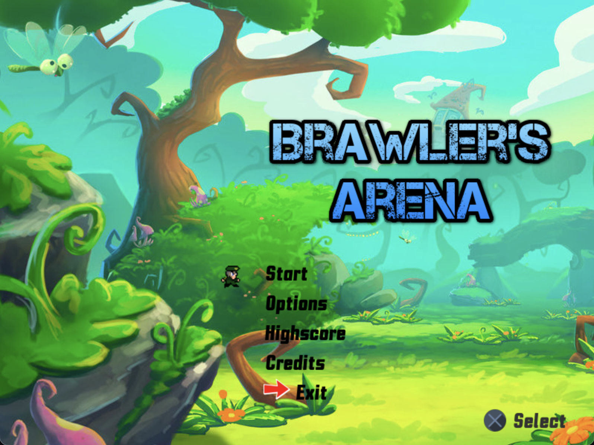
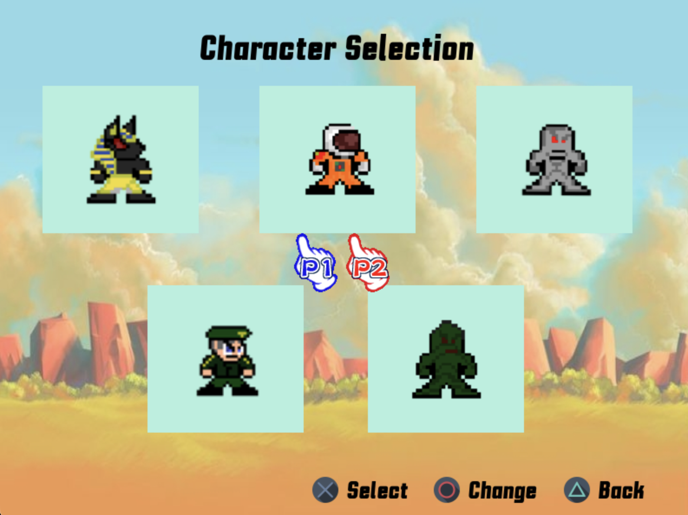
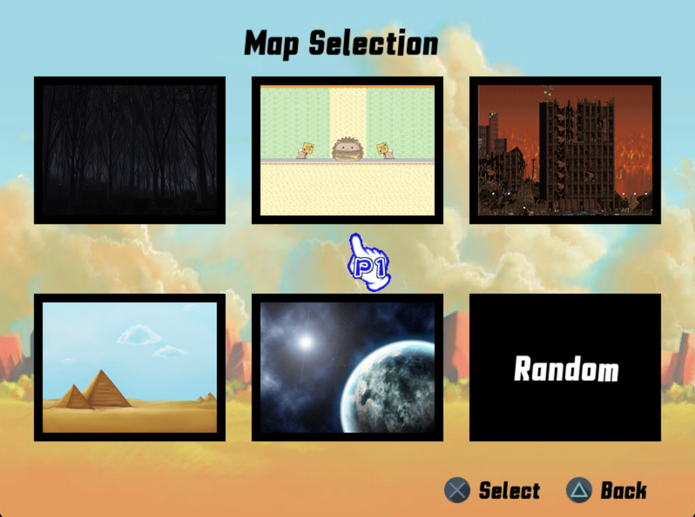
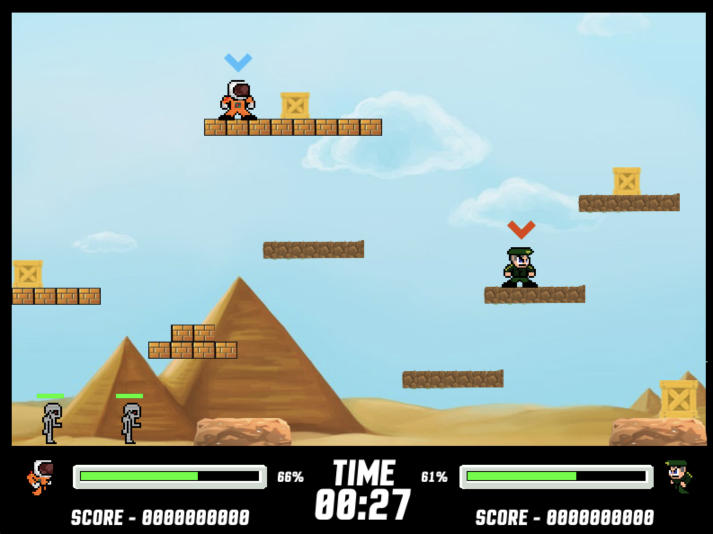

# Brawlers Arena

Brawlers Arena (2017) - Game Remake 

**[English](readme/README_EN.md) | [Español](readme/README_ES.md)**

A 2D fighting video game developed with Pygame.

## Screenshots

### Main Menu


### Character Selection


### Map Selection


### Gameplay Screen


## Features

- Multiple playable characters
- Various battle maps
- Scoring system
- Joystick controls
- Music and sound effects

## Requirements

- Python 3.5+
- Pygame
- Numpy

## Installation

### 1. Clone the repository
```bash
git clone https://github.com/nekomaruh/brawlers_arena.git
cd brawlers_arena
```

### 2. Create a virtual environment
```bash
python3 -m venv venv
```

### 3. Activate the virtual environment

**On macOS/Linux:**
```bash
source venv/bin/activate
```

**On Windows:**
```bash
venv\Scripts\activate
```

### 4. Install dependencies
```bash
pip install pygame numpy
```

### 5. Run the game
```bash
python PLAY.py
```

## Usage

Once the game is running, use your keyboard or joystick to:
- Navigate menus
- Select your character
- Choose your battle map
- Fight against other players

## License

This project is **for educational use only**. If you wish to copy, distribute, or use this code, **you must give credit and reference** to the original project and its authors.

See LICENSE file for more details.
